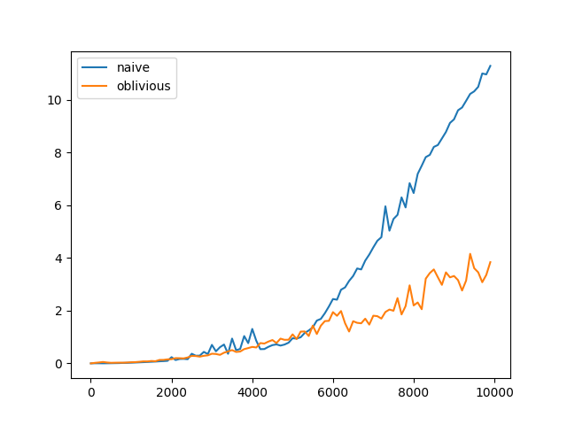

# Домашнее задание 2 по Архектурам ЭВМ (Георгий Каданцев, М3136)

Я выбрал реализовать двумя способами алгоритм **транспонирования матриц**. 
График показывает, что кэш-эффективная реализация начинает работать быстрее почти сразу, разница становится особенно заметна на рубеже 6000.

* Наивная реализация -- naive.py
* Кеш-эффективная реализация -- oblivious.py

Оба алгоритма тестируются по три раза, графики построены по арифметическому среднему трёх запусков алгоритма. 
Параметр **n** увеличивается линейно с шагом 100, начиная с 1. 
Транспонируются квадратные матрицы размерностью n x n.  

